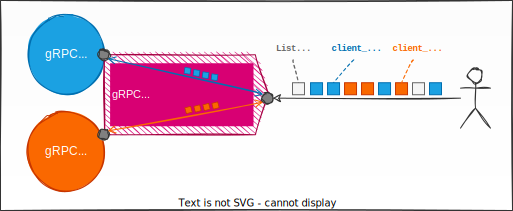

# gRPC Multiplexer

gRPC Multiplexer is a proxy to allow communication with one or multiple gRPC servers that can be behind a NAT router.
All these gRPC servers are reachable through a unique endpoint from the Multiplexer Server.

The whole implementation is done in Golang programming language (v1.18+).
It's mainly based on [gRPC-Go](https://github.com/grpc/grpc-go), [Yamux](https://github.com/hashicorp/yamux) and [gRPC Proxy](https://github.com/fuhrmannb/grpc-proxy).

## How does it work

### Architecture


gRPC Multiplexer is decoupled into two different programs.

#### gRPC Multiplexer Server

The _Multiplexer Server_ allows end-users to access to the different connected gRPC servers.

There are two endpoints on the Server:

* The _proxy endpoint_ that allows access to the connected client.
* The _multiplexer endpoint_ for Multiplexer Clients to connect and create tunnels to the Multiplexer Server. 

#### gRPC Multiplexer Client

The _Multiplexer Client_ is a bridge between the Multiplexer Server and a gRPC Server.
It redirects all gRPC requests from the multiplexer to the gRPC Server.

To identify the client, a _Client ID_ can be specified (or generated automatically if not).

### The proxy endpoint



The proxy endpoint allows access to:

* Each connected gRPC server (through the Multiplexer Client). The gRPC API is the same as the destination gRPC Server.
  Only a gRPC metadata `client-id` should be specified with the ID of the Multiplexer Client to specify the server to send the request to.
* The [Discovery gRPC API](protobuf/grpc/multiplexer/discovery.proto) that allows user to list the connected gRPC servers.

## Installation 

Download the [latest release](https://github.com/fuhrmannb/grpc-multiplexer/releases) for your architecture.
It contains both server & client programs that can be run without any dependency to install.

## Usage

Start the multiplexer server with listener specification for both multiplexer and proxy endpoints:

```shell
# Suppose the IP hosting the multiplexer server if 1.2.3.4
./grpc-multiplexer-server --multiplexer-listener 0.0.0.0:12345 --proxy-listener 0.0.0.0:1234
```

Connect a multiplexer client to the multiplexer with ID `rainbow`:

```shell
# Suppose the destination gRPC server is located on localhost, port 4444 
./grpc-multiplexer-client --client-id rainbow --multiplexer-address 1.2.3.4:12345 --grpc-server-address localhost:4444
```

For both application, use `--help` to have more information on their usage.

You can also configure the same options in a YAML file located:

* In your Home folder: `$HOME/.grpc-multiplexer-server` and `$HOME/.grpc-multiplexer-server`.
* Globally on the system: `/etc/grpc-multiplexer/grpc-multiplexer-server.yaml` and `/etc/grpc-multiplexer/grpc-multiplexer-client.yaml`
* Specifying the config location using `--config` CLI flag.

## Contributing

Pull requests are welcome. For major changes, please open an issue first to discuss what you would like to change.

Please make sure to update tests as appropriate.

## License

[MIT](LICENSE)